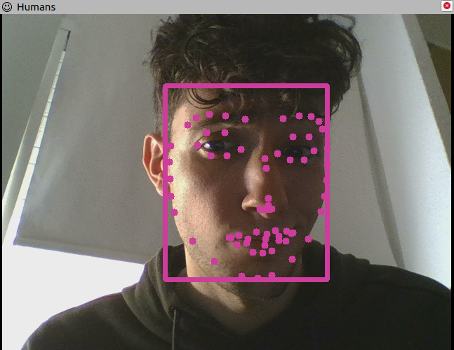

ROS4HRI Face Detection
======================

A simple 'test' ROS node to perform fast face detection using Google Mediapipe
[Face Detection](https://google.github.io/mediapipe/solutions/face_detection)
or [Face Mesh 
Detection](https://google.github.io/mediapipe/solutions/face_mesh.html)


The node publishes detected faces using the ROS4HRI conventions. 
It specifically publishes:

- `humans/faces/<faceID>/roi` as `sensor_msgs/RegionOfInterest.msg`
- `humans/faces/<faceID>/cropped` as `sensor_msgs/Image.msg`
- `humans/faces/<faceID>/landmarks` as `hri_msgs/FacialLandmarks.msg`
- `humans/faces/tracked` as `hri_msgs/IdsList.msg`

**This node is meant to be used as a baseline for testing purpose. 
Actual ROS4HRIpipelines should instead use eg the Mediapipe 
Holistic model.**

Parameters
----------

- ``image``: default topic for image subscription. Can be remapped
  using either ``roslaunch`` or ``rosrun`` as ``image:=/your/camera/topic``.   
- ``camera_info``: default topic for camera parameters subscription. 
  Can be remapped using either ``roslaunch`` or ``rosrun`` as 
  ``camera_info:=/your/camera_info/topic``.
- ``face_mesh`` (``True``(default) or ``False``): if true, the node applies 
  Mediapipe face mesh estimation on the incoming images. Otherwise, it applies
  Mediapipe face estimation. 
- ``max_num_faces`` (integer, default: ``10``): 
  the maximum number of faces that the face mesh estimator can detect.

Pre-requistes
-------------

```
> pip install mediapipe
```
Documentation
-------------

- [ROS4HRI to Mediapipe facial 
landmarks indexing](doc/mediapipe_face_mesh_2_ros4hri.md)

Visualization
-------------

[hri_rviz](../hri_rviz) provides Humans, an rviz plugin to easily visualize 
faces bounding boxes and facial landmarks.

